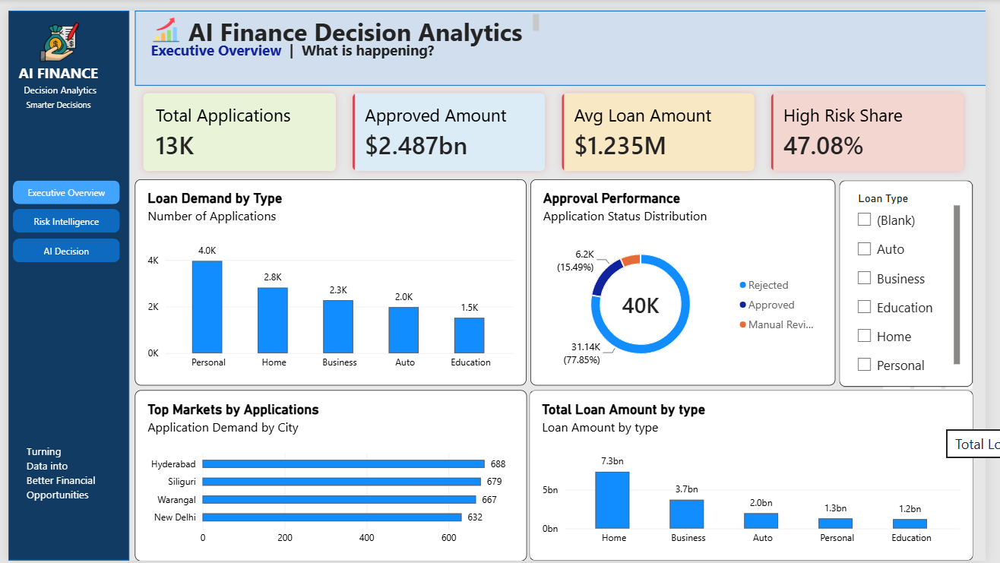
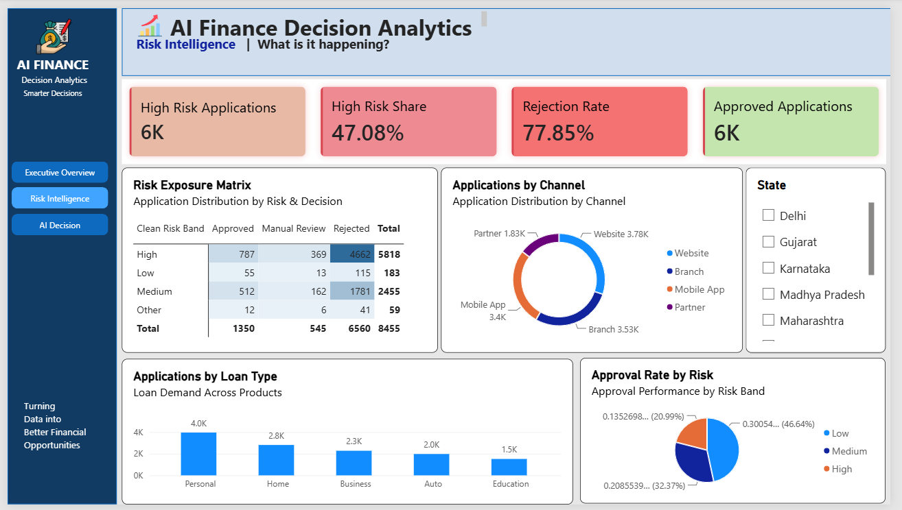
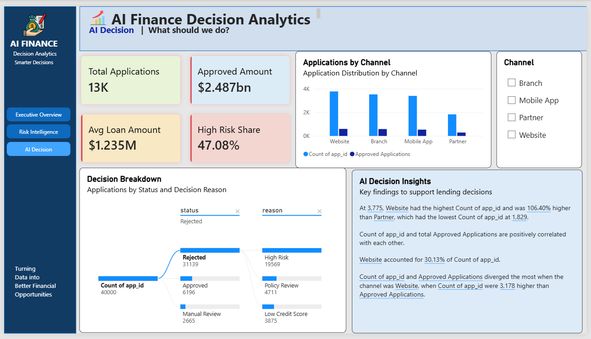

# 📈 AI_Finance_Decision_Analytics

### AI-Assisted Lending & Financial Decision Intelligence

**AI_Finance_Decision_Analytics** is an end-to-end Business Intelligence project built using **MySQL, SQL, Power BI and DAX** to analyze loan applications, approval performance, customer profiles and risk exposure.

The project transforms lending data into interactive dashboards that help understand:

- Loan demand and application trends
- Approval and rejection performance
- Customer credit and income patterns
- Risk exposure
- Loan products and channels
- Lending decision patterns

The final solution follows a simple decision journey:

```text
Raw Lending Data
       ↓
SQL Analysis & Validation
       ↓
Power BI Data Modeling
       ↓
DAX KPI Analysis
       ↓
Executive Overview
       ↓
Risk Intelligence
       ↓
AI-Assisted Decision Insights
```

---

# 🎯 Business Problem

Financial institutions receive large volumes of loan applications containing customer, loan, risk and decision information.

Without proper analytics, it becomes difficult to understand:

- Which loan products receive the highest demand?
- What percentage of applications are approved?
- Which risk bands have higher rejection levels?
- How do credit score and income affect approval?
- Which channels generate more applications?
- Which customer markets show stronger lending opportunities?
- What factors should be considered while making lending decisions?

This project provides a centralized analytical solution to answer these questions.

---

# ❓ Key Business Questions

### 📊 Application Performance

- What is the total application volume?
- Which loan types have the highest demand?
- What is the overall approval rate?
- What is the average loan amount?

### ⚠️ Risk Analysis

- How much application volume is high risk?
- Which risk bands have higher rejection?
- How does approval performance vary by risk?
- What is the overall risk exposure?

### 👤 Customer Analysis

- How does credit score affect approval?
- How does income affect approval?
- Which cities generate the highest application volume?

### 🤖 Decision Intelligence

- What are the major decision patterns?
- Which decision reasons contribute to rejection?
- What insights can support better lending decisions?

---

# 🗃️ Dataset

The project uses synthetic lending data containing **160,000 records across four tables**.

| Table | Records | Purpose |
|---|---:|---|
| `customer` | 40,000 | Customer profile & financial information |
| `loan` | 40,000 | Loan application details |
| `risk` | 40,000 | Risk assessment information |
| `decision` | 40,000 | Final lending decisions |

### Customer

Includes customer demographics, location, job, income, credit score and existing loans.

### Loan

Contains application ID, loan type, amount, duration and application channel.

### Risk

Contains risk score, risk band, eligibility, debt ratio and verification information.

### Decision

Contains application status, decision reason, approval indicator and interest rate.

> **Note:** The dataset is synthetic and is intended only for analytics, visualization and portfolio demonstration.

---

# 🧹 Data Preparation & SQL Analysis

MySQL was used to inspect, validate and analyze the lending dataset before connecting it to Power BI.

### Main SQL Operations

- Table and column validation
- Data inspection
- Joins across related tables
- Aggregations
- Conditional logic using `CASE`
- Approval and rejection analysis
- Risk analysis
- Market analysis

### Example — Loan Demand

```sql
SELECT type,
       COUNT(*) AS applications
FROM loan
GROUP BY type
ORDER BY applications DESC;
```

### Example — Approval Analysis

```sql
SELECT l.type,
       COUNT(*) AS applications,
       SUM(d.approved) AS approved
FROM loan l
JOIN decision d
ON l.app_id = d.app_id
GROUP BY l.type;
```

SQL analysis was used to validate business metrics before dashboard development.

---

# 🔗 Data Model

The Power BI model uses relationships across the four lending tables.

```text
customer
   │
   │ id
   ▼
loan
   │
   │ app_id
   ├──────────► risk
   │
   └──────────► decision
```

### Relationships

```text
customer[id] → loan[id]

loan[app_id] → risk[app_id]

loan[app_id] → decision[app_id]
```

This model allows customer, loan, risk and decision information to be analyzed together.

---

# 📐 DAX & KPI Analysis

DAX measures were created for the major business KPIs.

### Approval Rate

```DAX
Approval Rate =
DIVIDE(
    CALCULATE(
        COUNTROWS(decision),
        decision[status] = "Approved"
    ),
    COUNTROWS(loan),
    0
)
```

### Approved Amount

```DAX
Approved Amount =
CALCULATE(
    SUM(loan[amount]),
    decision[status] = "Approved"
)
```

### High Risk Share

```DAX
High Risk Share =
DIVIDE(
    CALCULATE(
        COUNTROWS(risk),
        risk[band] = "High"
    ),
    COUNTROWS(loan),
    0
)
```

Other measures include:

- Total Applications
- Approved Applications
- Total Loan Amount
- Average Loan Amount
- High Risk Applications
- Rejection Rate
- Average Risk Score
- Approval Rate by Risk

---

# 📊 Dashboard Overview

The Power BI report contains three analytical pages designed around key lending and financial decision questions.

---

# 1️⃣ Executive Overview

### What is happening?



The Executive Overview provides a high-level view of lending performance.

### Key KPIs

- Approval Rate
- Approved Amount
- Average Loan Amount
- High Risk Share

### Key Analysis

- Loan Demand by Type
- Approval Performance
- Top Markets by Applications
- Total Loan Amount by Type

This page provides a quick understanding of application demand, approval performance, market activity and overall loan value.

---

# 2️⃣ Risk Intelligence

### What is happening?



The Risk Intelligence page focuses on application risk and lending exposure.

### Key KPIs

- High Risk Applications
- High Risk Share
- Rejection Rate
- Average Risk Score

### Key Analysis

- Risk Exposure Matrix
- Approval Rate by Risk
- Applications by Loan Type
- Applications by Channel

This page helps identify risk distribution and understand how lending decisions vary across different risk segments.

---

# 3️⃣ AI Decision

### What should we do?



The AI Decision page focuses on decision analysis and business interpretation.

### Key Features

- **Decision Breakdown** — Power BI Decomposition Tree
- **AI Decision Insights** — Power BI Smart Narrative
- **Approval Rate by Loan Type**

The page converts analytical patterns into decision-support insights and helps interpret lending decisions.

---

# 🧠 AI Approach

The project uses an **AI-assisted Business Intelligence approach** rather than building a custom machine learning model.

Power BI's built-in analytical capabilities are used to support decision intelligence:

- **Decomposition Tree**
- **Smart Narrative**
- Interactive filtering
- DAX-based analytical measures

The AI layer focuses on making analytical results easier to explore and interpret.

> No external AI API or custom machine learning model is claimed in this project.

---

# ⭐ Project Highlights

### ✔️ End-to-End Analytics Workflow

Demonstrates the complete flow from raw lending data to business insights.

### ✔️ SQL-Based Analysis

Uses MySQL for data inspection, joins, validation and business analysis.

### ✔️ Power BI Data Modeling

Connects customer, loan, risk and decision information through relational relationships.

### ✔️ DAX KPI Analysis

Uses measures for approval, rejection, loan value and risk metrics.

### ✔️ AI-Assisted Analytics

Uses Power BI Decomposition Tree and Smart Narrative for decision intelligence.

### ✔️ Business-Focused Dashboard Design

Dashboards are designed around practical lending and risk questions rather than only displaying raw numbers.

---

# 💼 Business Value

The solution can help lending teams understand:

- Application demand
- Approval performance
- Risk exposure
- Rejection patterns
- Loan product performance
- Customer segments
- Application channels
- Market opportunities

The objective is to support **data-driven lending analysis and better business decisions**.

---

# 🛠️ Technology Stack

## SQL

- MySQL
- SELECT
- JOIN
- GROUP BY
- CASE
- Aggregations
- Data Validation
- Business Analysis

## Power BI

- Data Modeling
- Relationships
- KPI Cards
- Column Charts
- Bar Charts
- Donut Charts
- Matrix
- Slicers
- Decomposition Tree
- Smart Narrative

## DAX

- `CALCULATE`
- `COUNTROWS`
- `SUM`
- `AVERAGE`
- `DIVIDE`
- `SWITCH`
- Conditional Business Logic
- KPI Calculations

## Business Analytics

- Lending Analytics
- Approval Analysis
- Rejection Analysis
- Risk Analytics
- Loan Product Analysis
- Channel Analysis
- Customer Analysis
- Decision Support

---

# 📁 Repository Structure

```text
AI_Finance_Decision_Analytics
│
├── Images
│   ├── Executive Overview.png
│   ├── Risk Intelligence.png
│   ├── AI Decision.png
│   └── README.md
│
├── Dataset
│   ├── Raw Data
│   │   ├── customer.csv
│   │   ├── loan.csv
│   │   ├── risk.csv
│   │   └── decision.csv
│   │
│   ├── SQL File
│   │   └── Finance_Analysis.sql
│   │
│   └── Power BI File
│       └── AI_Finance_Decision_Analytics.pbix
│
└── README.md
```

---

# 🔄 How to Explore the Project

### 1. Review the Dataset

Start with the synthetic customer, loan, risk and decision data.

### 2. Review SQL Analysis

Open the SQL file to understand the joins, validations and business analysis.

### 3. Open Power BI

Open the `.pbix` report to explore the complete analytical model.

### 4. Explore the Dashboard

Navigate through:

```text
Executive Overview
        ↓
Risk Intelligence
        ↓
AI Decision
```

Use the available slicers and interactive visuals to explore different lending scenarios.

---

# 🎯 Project Objective

The main objective of this project is to demonstrate how **SQL + Power BI + DAX + AI-assisted analytics** can transform lending data into an interactive decision-support solution.

---

# 🚀 Conclusion

**AI_Finance_Decision_Analytics** demonstrates how raw lending data can be transformed into a professional Business Intelligence solution using MySQL, SQL, Power BI and DAX.

The project combines:

```text
Data Preparation
      ↓
SQL Analysis
      ↓
Data Modeling
      ↓
DAX KPIs
      ↓
Executive Analytics
      ↓
Risk Intelligence
      ↓
AI-Assisted Insights
      ↓
Decision Support
```

The final solution helps stakeholders move from:

> **"What is happening?"**

to:

> **"What is happening from a risk perspective?"**

and finally:

> **"What should we do?"**

---

# 👨‍💻 Author

## Karan Darode

**B.Tech — Information Technology**

### Areas of Interest

- Data Analytics
- Business Intelligence
- SQL
- MySQL
- Power BI
- DAX
- Data Visualization
- Financial Analytics
- Risk Analytics
- Decision Intelligence

---

## ⭐ Project

**AI_Finance_Decision_Analytics**

> **Transforming financial data into insights, insights into better decisions.**
