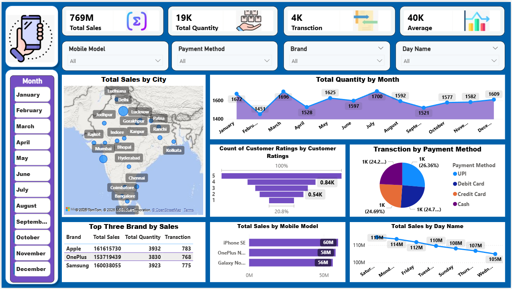
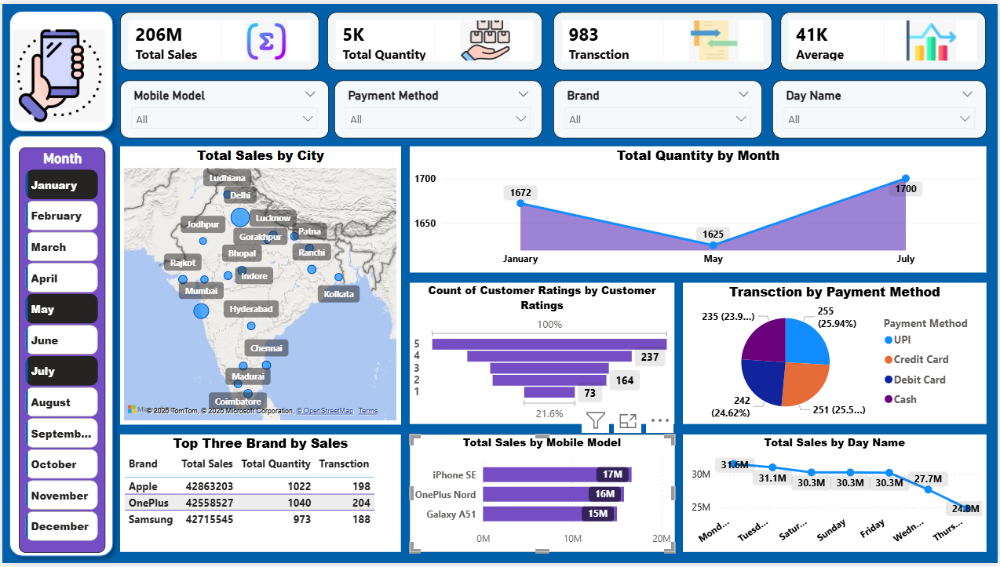
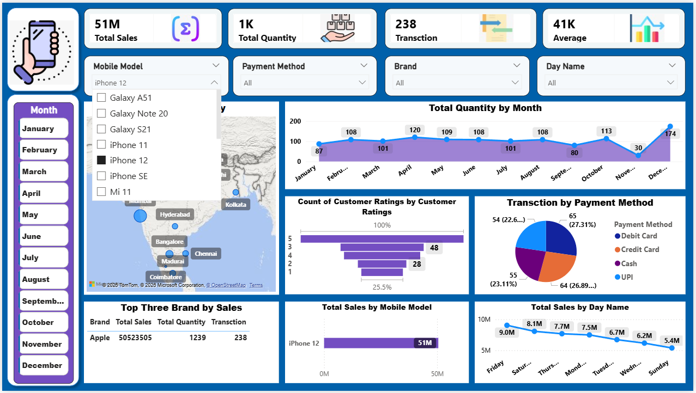
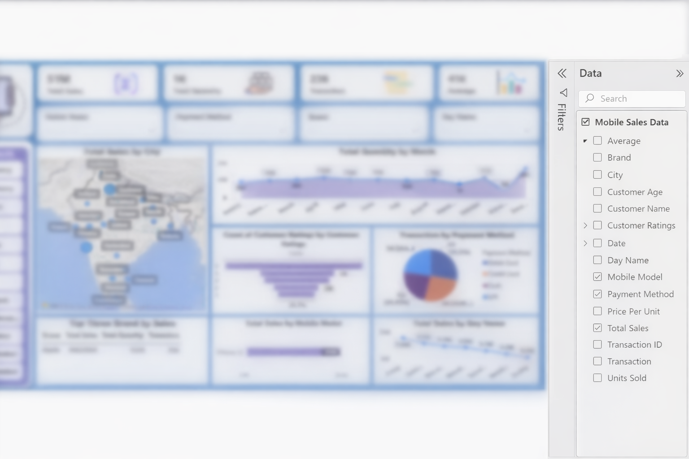

# 🛒 Ecommerce Sales & Business Analytics

---

## 🚀 Project Overview

This project delivers a **Power BI Ecommerce Sales & Business Analytics Dashboard** focused on **E-commerce Sales, Revenue Performance, Product Trends, Customer Behavior, Payment Insights, and Market Analysis**.

It converts raw transactional data into **actionable business intelligence**, enabling stakeholders to monitor KPIs, identify sales trends, understand customer behavior, and support data-driven decisions.

---

## 🎯 Business Problem

E-commerce businesses often face challenges such as:

- Lack of centralized sales visibility
- Difficulty tracking product and brand performance
- Limited understanding of customer purchasing behavior
- Difficulty analyzing payment preferences
- Limited visibility into regional and time-based sales trends

### ✅ Solution

An **interactive, filter-driven Power BI dashboard** that provides:

- Sales & revenue monitoring
- Product and brand performance analysis
- Customer behavior insights
- Payment method analysis
- Regional market analysis
- Monthly and daily sales trends

---

## 📌 Dashboard Capabilities

### 📈 Sales Performance

- 💰 Total Sales
- 🔄 Total Transactions
- 📦 Total Quantity
- 📊 Average Sales

### 🌍 Regional & Market Analysis

- City-level sales performance
- Regional demand comparison
- Market contribution analysis
- High-performing locations

### 📅 Sales Trend Analysis

- Monthly sales trends
- Day-wise sales performance
- Seasonal sales patterns
- Period-wise performance comparison

### 🛍️ Product & Brand Analytics

- Brand-wise sales comparison
- Top-performing products
- Product demand analysis
- Product-level performance

### 💳 Payment Analytics

- UPI transactions
- Debit Card transactions
- Credit Card transactions
- Cash transactions

### ⭐ Customer Insights

- Customer rating distribution
- Customer satisfaction patterns
- Rating-based performance analysis

### 🎛️ Dynamic Slicers

- Brand
- Product Model
- Month
- Payment Method
- Day Name
- City

---

## 📐 Key DAX Measures

    Total Sales = SUM(Sales[Total_Sales])

    Total Quantity = SUM(Sales[Quantity])

    Total Transactions = COUNT(Sales[Transaction_ID])

    Average Sales = DIVIDE([Total Sales], [Total Transactions])

---

## 🖼️ Dashboard Preview

### 🔹 Main Dashboard

The main dashboard provides a consolidated view of **sales KPIs, product performance, customer ratings, payment methods, and regional sales**.

### 🔹 Month-Wise Analysis

This view enables users to analyze **monthly sales performance and identify changes in demand over time**.

### 🔹 Interactive Slicer Analysis

Dropdown slicers allow users to dynamically filter the dashboard by **City, Brand, Payment Method, Product Model, and Weekday**.

### 🔹 Measures & Data Fields

This view highlights the organization of **calculated measures and data fields** used for business analysis.

---

## 🛠️ Tech Stack

| Technology | Usage |
|------------|------|
| Power BI | Dashboard Development |
| DAX | KPI & Business Calculations |
| Power Query | Data Cleaning & Transformation |
| Excel | Data Source |

---

## 🧠 Key Business Insights

- 📍 Major cities contribute significantly to overall sales
- 🛍️ A limited number of products and brands drive a large share of revenue
- 💳 Digital payment methods represent a major share of transactions
- 📅 Sales performance varies across months and weekdays
- ⭐ Customer ratings provide useful indicators of customer experience

---

## ⚙️ How to Run

1. Clone the repository
2. Open the `.pbix` file using Power BI Desktop
3. Load or refresh the dataset if required
4. Interact with dashboard filters and visuals
5. Explore sales and business insights

---

## 🔗 Useful Resources

- 📊 [Microsoft Power BI](https://www.microsoft.com/en-us/power-platform/products/power-bi)
- 📚 [DAX Documentation](https://learn.microsoft.com/en-us/dax/)
- 🧹 [Power Query Documentation](https://learn.microsoft.com/en-us/power-query/)

---

## 💼 Why This Project Stands Out

✔ End-to-end **E-commerce Analytics** solution  
✔ Interactive Power BI dashboard  
✔ Business-focused KPI analysis  
✔ Product & customer intelligence  
✔ Sales & revenue performance analysis  
✔ Strong data visualization and storytelling  
✔ Practical use of DAX and Power Query  

---

## ⭐ Support

If this project adds value, consider giving it a ⭐
